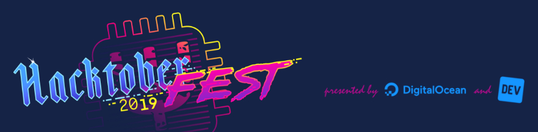
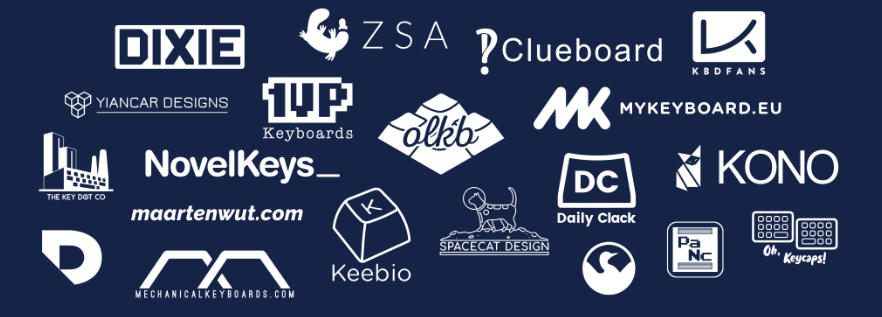

Hacktober­fest® with QMK!
=========================

In addition to participating in [Hacktoberfest](https://hacktoberfest.digitalocean.com/), QMK is also celebrating its 4 year anniversary[\[1\]](https://github.com/qmk/qmk_firmware/commit/abc1c0e31e880861cf82e674bb4ffce9f4e13858) this month and giving away a QMK-specific Hacktoberfest t-shirt to anyone that meets these requirements during the month of October.

How to qualify for a QMK t-shirt:
---------------------------------

*   [Donate $15 to cKeys](https://ckeys.org/donate/), a 501(c)(3) non-profit that connects and educates people interested in keyboards and technology
*   _or_ Interact with 4 [QMK repos](https://github.com/qmk) in any of these ways:

    *   Review/suggest significant changes on a PR that's labelled [`hacktoberfest`](https://github.com/qmk/qmk_firmware/pulls?utf8=✓&q=is%3Apr+is%3Aopen+label%3Ahacktoberfest+)
    *   Make a comment on an Issue/PR that contributes to the conversation that's labelled [`hacktoberfest`](https://github.com/search?q=org%3Aqmk+label%3Ahacktoberfest&type=Issues)
    *   Open a PR that documents any new feature that's consistent with our doc style (check out the [`needs doc`](https://github.com/qmk/qmk_firmware/issues?q=label%3A"needs+doc") label)
    *   Open a PR that [translates](#translating) some documentation
    *   Open a PR that fixes a bug in an issue labelled [`hacktoberfest`](https://github.com/search?q=org%3Aqmk+label%3Ahacktoberfest&type=Issues)

*   We're open to ideas! Anything we determine to be a significant contribution to QMK (including any of the above actions that are large enough in size/scope) will qualify!

### [Check to see how you're doing with the tool on the website](https://hacktoberfest.qmk.fm)

Once you have donated or completed the requirements, click the link below to fill out the form! Feel free to submit even if the tool above doesn't recongise your contributions - we'll be validating all of the entries at the end of the month.

[DigitalOcean's quality standards for opening pull requests](https://hacktoberfest.digitalocean.com/details#quality-standards) should apply to the actions mentioned above:

> In line with Hacktoberfest value #2 (Quantity is fun, quality is key), here are examples of the PRs that we consider to be low-quality contributions (which we discourage).
> 
> *   PRs that are automated (e.g. scripted opening PRs to remove whitespace/optimize images)
> *   PRs that are disruptive (e.g. taking someone else's branch/commits and making a PR)
> *   PRs that are regarded by a project maintainer as a hindrance vs. helping
> *   Something that's clearly an attempt to simply +1 your PR count for October
> *   Last but not least, one PR to fix a typo is fine. 5 PRs to remove a stray whitespace... not.

## [Claim your QMK t-shirt](https://docs.google.com/forms/d/e/1FAIpQLSeFt0mmW2e8tFgTsGGlSUET_8dpGiyuOTZKyS5g2jcIM20d-Q/viewform)

Be sure to check out all [the details on Hacktoberfest](https://hacktoberfest.digitalocean.com/), how you can find an event near you, and claim your reward offered by DigitalOcean and DEV.

### This QMK event is graciously sponsored by the following vendors:

Interested in sponsoring a dollar amount per shirt claimed? Reach out to us!

F.A.Q.
------

### What is QMK?

QMK is an open source software project that spans from the embedded firmware that runs on your keyboard to tools that help you compile it, and the software that helps put it on the device. Practically they're split into the [firmware](https://github.com/qmk/qmk_firmware), the [configurator](https://github.com/qmk/qmk_configurator), and the [toolbox](https://github.com/qmk/qmk_toolbox), and a several other repos. It started as Jack's personal fork of [Hasu's TMK Keyboard Firmware](https://github.com/tmk/tmk_keyboard) with some small improvements simplifying the keymap, that's grown into the community-based project that it is today, run by a small team of collaborators.

### What's a code review?

Good question! We're not sure yet.

### How should I translate things?

Please have some technical knowledge of the language, and don't use Google translate. All PRs will be subject to review by native speakers if we can find them! Some good pages to start with are [the main readme](https://github.com/qmk/qmk_firmware/blob/master/docs/README.md), [the newbs guide](https://github.com/qmk/qmk_firmware/blob/master/docs/newbs.md), and [the configurator](https://github.com/qmk/qmk_configurator/tree/master/src/i18n). Any new translation should be put in a folder with the appropriate [language tags](https://www.w3.org/International/articles/language-tags/).

### Will I get this shirt instead of the regular Hacktoberfest shirt?

This give-away is totally separate from DigitalOcean and DEV - you'll need to qualify and fill out the form for each give-away. Please note they have different qualifications.

### Who can participate?

Anyone with a [Github](https://github.com/) account!

Hacktoberfest® is a registered trademark of DigitalOcean, and presented by DigitalOcean and DEV. This QMK-specific give-away is sponsored by QMK and the vendors listed above.